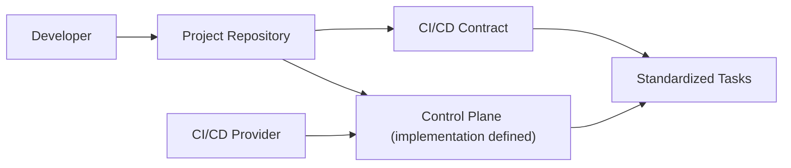
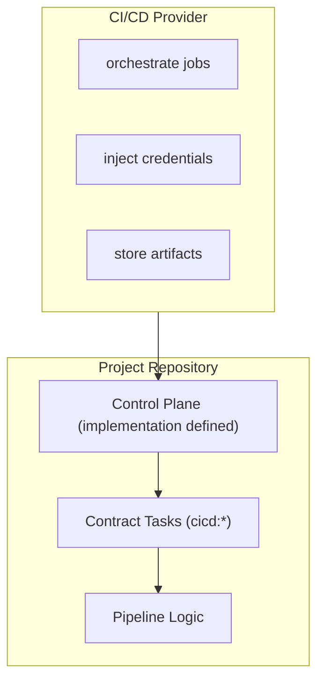

# open-cicd-contract

## What is it

**open-cicd-contract** is an open specification that defines a **standard CI/CD contract**, independent of any CI/CD provider.

Its goal is to decouple **pipeline logic** from **CI/CD platforms**, turning pipelines into a **versioned, portable, and reusable contract**.

This project does **not** execute pipelines.
It defines **how a project exposes its pipeline**, not how a provider orchestrates it.

---

## What this project is NOT

To avoid ambiguity:

- Not a CI/CD provider
- Not a pipeline engine
- Not a framework
- Not a collection of provider-specific YAML templates
- Not a replacement for GitHub Actions, GitLab CI, Azure DevOps, etc.

**open-cicd-contract is a convention and a contract, not an implementation.**

---

## Interface-first strategy

The design strategy of open-cicd-contract mirrors the classic software engineering principle of **programming to an interface, not an implementation**:

- The **Contract** is the interface: it defines *what* tasks exist (`cicd:*`), their order, inputs/outputs, and conventions.
- The **Control Plane** is an implementation: it contains the project-owned pipeline logic and implements the contract tasks.
- The **Provider** is an orchestrator implementation: it schedules work and invokes the Control Plane, while remaining independent from the pipeline internals.

This allows consumers (providers/orchestrators) to depend only on the contract interface, while projects can change Control Plane tooling and providers can vary (Jenkins, GitLab CI, Bitbucket Pipelines, GitHub Actions, etc.) without rewriting the core pipeline logic.

---

## The problem

Modern CI/CD pipelines suffer from recurring issues:

- Strong coupling to CI/CD providers
- Pipeline logic duplicated across repositories
- Large, hard-to-maintain YAML files
- Low portability between platforms
- Business-critical logic living outside the codebase

Changing a CI/CD provider usually means **rewriting pipelines**, even when the logical process remains the same.

---

## The proposal

**open-cicd-contract** introduces a simple but strict model:

1. **Pipeline as a contract**
2. **Providers as orchestrators**
3. **Code as the source of truth**
4. **Provider adapters (non-normative integration pattern)**

Pipeline behavior is defined by a **standard set of tasks**, implemented in the repository itself.

---

## Conceptual architecture

### Traditional CI/CD model


Problems:
- Business logic hidden in provider configuration
- Hard to reuse across repositories
- Hard to migrate between CI/CD providers

---

### Contract-based CI/CD model



---

## Control Plane

This specification uses the term **Control Plane** to describe the execution layer that runs the contract tasks.

- The CI/CD provider is responsible for orchestration (jobs, scheduling, credentials injection, artifact storage).
- The Control Plane is responsible for implementing and executing the contract tasks (`cicd:*`) and translating those task names into concrete repository commands.

In open-cicd-contract terms:

- **Provider**: a CI/CD engine that orchestrates execution. It calls the Control Plane.
- **Control Plane**: the project-owned implementation of the pipeline. It contains the pipeline logic.

The Provider MUST NOT contain the **core pipeline implementation** (the logic that makes `cicd:*` tasks work).
However, the Provider MAY include **platform-native and auxiliary concerns**, such as approvals, notifications, credential injection, artifact storage, and environment/tooling setup.

Its core responsibility in this specification is to invoke contract tasks through a single entry point:

```text
${CI_CONTROLPLANE_CMD} <task-name>
```

The Control Plane is intentionally **tool-agnostic**. It may be implemented using any task runner, build system, scripts, or language tooling.

---

## Pipeline lifecycle

A compliant pipeline exposes the following stages:

```
INIT → BUILD → QUALITY → VALIDATE → PUBLISH → (RELEASE)
```


---

## Providers as orchestrators

Providers act as orchestrators that call the Control Plane.
They must not contain the core pipeline implementation logic.



---

## Where to start

This repository is a specification. These documents have distinct roles:
- [contracts/v1/CONTRACT-open-cicd-contract.md](contracts/v1/CONTRACT-open-cicd-contract.md): the normative contract interface (`cicd:*` tasks, ordering, inputs/outputs, conventions)
- [rfcs/RFC-0001-open-cicd-contract.md](rfcs/RFC-0001-open-cicd-contract.md): motivation, scope boundaries, and architectural rationale
- [examples/](examples/): non-normative provider and Control Plane examples

If you want to contribute or adopt this specification in your organization:

- [CONTRIBUTING.md](CONTRIBUTING.md): how to contribute (including RFC-style changes)
- [GOVERNANCE.md](GOVERNANCE.md): decision-making and roles
- [VERSIONING.md](VERSIONING.md): semantic versioning rules for the specification
- [CHANGELOG.md](CHANGELOG.md): release notes
- [SECURITY.md](SECURITY.md): how to report security concerns
- [CODE_OF_CONDUCT.md](CODE_OF_CONDUCT.md): community expectations

---

## Outputs and invocation

Contract tasks may produce operational outputs (temporary data, reports, and distributable artifacts) using contract-defined conventions.

To keep the conceptual overview lightweight, this README does not list all environment variables.
See [contracts/v1/CONTRACT-open-cicd-contract.md](contracts/v1/CONTRACT-open-cicd-contract.md) for the normative inputs/outputs and the standard task invocation convention.
