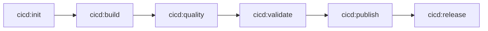

# CI/CD Contract v1 (open-cicd-contract)

## Status
Released

## Specification Version
v1.0.0

---

## Purpose

This document defines the **formal CI/CD contract** for projects adopting the **open-cicd-contract** specification.

It describes **mandatory and optional tasks**, **execution order**, **inputs**, **outputs**, and **conventions** required to be considered compliant.

This contract defines **what must exist**, not **how it must be implemented**.

---

## Compliance

A project is considered **open-cicd-contract compliant** if:

- All mandatory tasks are implemented
- Tasks respect expected inputs and outputs
- Exit codes follow the defined conventions
- Standard output conventions are respected

---

## Contract Interface

### Mandatory Pipeline Stages

Every compliant project MUST implement the following tasks:

| Stage | Task Name | Description |
|-----|----------|-------------|
| INIT | `cicd:init` | Initialize pipeline context and environment |
| BUILD | `cicd:build` | Build artifacts or infrastructure |
| QUALITY | `cicd:quality` | Enforce quality checks |
| VALIDATE | `cicd:validate` | Validate pipeline readiness |
| PUBLISH | `cicd:publish` | Publish artifacts |

---

### Optional Pipeline Stages

| Stage | Task Name | Description |
|------|----------|-------------|
| RELEASE | `cicd:release` | Deploy or release artifacts |

---

## Execution Order

The logical execution order is fixed:

```text
cicd:init
  → cicd:build
    → cicd:quality
      → cicd:validate
        → cicd:publish
          → cicd:release (optional)
```



CI/CD providers MAY skip optional stages but MUST preserve order.

---

## Control Plane

The contract defines *what tasks exist* and the required behaviors of those tasks.
It intentionally does not mandate *how tasks are implemented* or *which tool executes them*.

In this specification, a **Control Plane** is the execution layer that:

- Invokes contract tasks (for example: `cicd:init`, `cicd:build`, ...)
- Sets up the execution environment (working directory, environment variables, credentials provided by the CI/CD provider)
- Translates a task name into concrete commands implemented in the repository

The Control Plane MAY be implemented using any mechanism (task runner, build system, scripts, language tooling, etc.).

A compliant project SHOULD document how its Control Plane is invoked locally and in CI, but that documentation is not part of the normative contract interface.

To keep provider adapters tool-agnostic, orchestrators SHOULD use a single command entry point to invoke tasks.
This command is represented by the standard environment variable `CI_CONTROLPLANE_CMD`.

The CI/CD provider (orchestrator) typically also handles platform-native concerns such as approvals, notifications, credential injection, and artifact storage.
These concerns are intentionally out of scope for the contract and MUST NOT be required to implement `cicd:*` tasks.

---

## Task Behavior

### General Rules

- Tasks MUST be idempotent when possible
- Tasks MUST fail fast on unrecoverable errors
- Tasks MUST return proper exit codes
- Tasks MUST log meaningful output

---

### Exit Codes

| Code | Meaning |
|----|--------|
| 0 | Success |
| 1 | Validation or quality failure |
| >1 | Execution or system failure |

---

## Standard Inputs (Environment Variables)

All tasks SHOULD support the following environment variables:

| Variable | Description |
|--------|-------------|
| `CI` | Indicates CI execution (`true` / `false`) |
| `CI_PROVIDER` | Name of CI/CD provider |
| `CI_COMMIT_SHA` | Commit identifier |
| `CI_VERSION` | Release or build version |
| `PROFILE` | Execution profile (`local`, `ci`, `release`) |
| `CI_CONTROLPLANE_CMD` | Command used by the orchestrator to invoke contract tasks (default: `task`) |
| `CI_ROOT_PATH` | Base working directory for CI/CD outputs (default: `./.opencicd`) |
| `CI_DIST_PATH` | Directory for publishable packages and build artifacts (default: `${CI_ROOT_PATH}/_dist`) |
| `CI_REPORTS_PATH` | Directory for test/quality reports and static report sites (default: `${CI_ROOT_PATH}/_reports`) |
| `CI_TEMP_PATH` | Directory for temporary files, logs, and troubleshooting data (default: `${CI_ROOT_PATH}/_temp`) |

Tasks MAY define additional variables.

---

## Standard Outputs

Tasks SHOULD produce outputs in standardized locations.

The output locations are defined by environment variables, to keep the contract portable across repository layouts (for example: monorepos):

- `CI_ROOT_PATH` (default: `./.opencicd`)
- `CI_DIST_PATH` (default: `${CI_ROOT_PATH}/_dist`)
- `CI_REPORTS_PATH` (default: `${CI_ROOT_PATH}/_reports`)
- `CI_TEMP_PATH` (default: `${CI_ROOT_PATH}/_temp`)

If a path is relative, it MUST be interpreted relative to the repository root.

Orchestrators SHOULD invoke tasks by running:

```text
${CI_CONTROLPLANE_CMD} <task-name>
```

For example:

```text
${CI_CONTROLPLANE_CMD} cicd:init
```

Tasks SHOULD write artifacts and reports according to these paths:

| Path | Purpose |
|-----|--------|
| `CI_DIST_PATH` | Build artifacts and publishable packages (staging) |
| `CI_REPORTS_PATH` | Test, quality, and other CI/CD reports |
| `CI_TEMP_PATH` | Temporary execution data (logs, troubleshooting data) |

The directories referenced by `CI_TEMP_PATH`, `CI_REPORTS_PATH`, and `CI_DIST_PATH` MUST NOT be committed to version control.

---

## Directory Conventions

A compliant repository SHOULD:

- Produce outputs in directories defined by the standard output variables above
- Provide a documented Control Plane entry point (implementation-defined)

The following layout is RECOMMENDED as a non-normative example:

```text
.
├── .opencicd/
│   ├── _dist/
│   ├── _reports/
│   ├── _temp/
├── (control plane entry point; implementation-defined)
└── README.md
```

---

## Tooling Independence

The contract does not mandate any specific tool.

Implementations MAY use any execution mechanism, as long as the contract interface is respected.

Concrete, tool-specific examples are non-normative and SHOULD live under `examples/`.

---

## Versioning and Compatibility

- This contract follows semantic versioning
- Minor versions add optional capabilities
- Major versions may introduce breaking changes
- Providers and projects SHOULD declare supported versions

---

## Validation

Future tooling MAY validate compliance automatically by:

- Verifying required tasks exist
- Executing tasks in dry-run mode
- Inspecting outputs and exit codes

---

## Conclusion

This contract establishes a **stable, portable interface** for CI/CD pipelines.

By standardizing the interface instead of the implementation, projects gain flexibility, portability, and long-term maintainability.
