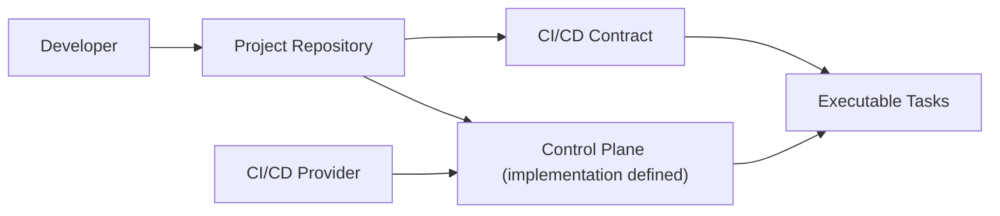

# RFC-0001: Open CI/CD Contract

## Status
Accepted

## Summary

This RFC defines the motivation, principles, scope, and architectural model of the **open-cicd-contract** initiative.

The goal is to establish a **provider-agnostic CI/CD contract**, allowing pipelines to be defined as a stable interface implemented in code, rather than embedded in CI/CD provider-specific configurations.

This RFC also defines the boundary between:

- **Orchestration** (the CI/CD provider)
- **Execution** (a project-defined Control Plane that runs the contract tasks)

The strategy is intentionally interface-oriented: **consumers depend on the contract interface**, while implementations (Control Plane tooling and CI/CD providers) can vary.

---

## Motivation

CI/CD pipelines have become critical infrastructure, yet their implementation remains fragmented and tightly coupled to specific providers.

Common problems observed across organizations:

- Pipelines tightly bound to GitHub Actions, GitLab CI, Azure DevOps, etc.
- Business logic embedded in YAML definitions
- High duplication of pipeline logic across repositories
- Costly migrations when changing CI/CD providers
- Limited testability and visibility of pipeline behavior

Despite these issues, the logical structure of pipelines is largely identical across providers.

This RFC proposes formalizing that shared structure as a **contract**.

---

## Terminology

- **Contract**: the normative definition of required/optional tasks, ordering, inputs, outputs, and conventions.
- **Stage**: a logical step in the pipeline lifecycle (INIT, BUILD, QUALITY, VALIDATE, PUBLISH, RELEASE).
- **Task**: an executable entry point exposed by the repository (for example: `cicd:build`). Tasks implement stages.
- **Control Plane**: the project-owned implementation layer that translates a task name into concrete repository commands and runs them.
- **Provider (Orchestrator)**: the CI/CD engine that schedules jobs and invokes the Control Plane. It MUST NOT contain the core pipeline implementation logic (the logic that makes `cicd:*` tasks work). It MAY include platform-native concerns (approvals, notifications, credential injection, artifact storage, environment/tooling setup). It SHOULD invoke tasks via a single entry point (`CI_CONTROLPLANE_CMD`).

---

## Goals

- Define CI/CD pipelines as a **contractual interface**
- Decouple pipeline logic from CI/CD providers
- Enable true portability between CI/CD platforms
- Allow incremental adoption without rewriting pipelines
- Encourage community-driven standardization

---

## Non-Goals

This RFC explicitly does NOT aim to:

- Build a CI/CD engine
- Replace existing CI/CD providers
- Standardize provider-specific orchestration features
- Manage secrets, approvals, or environment promotion
- Define or mandate governance/policy enforcement mechanisms
- Enforce a specific tooling stack

---

## Governance and Policy Enforcement (Out of Scope)

This model intentionally moves the **core pipeline implementation** (the Control Plane that makes `cicd:*` tasks work) into the repository, which typically places it under the development team's normal change process.

Organizations may still require governance controls over that implementation (for example: preventing unauthorized changes to the Control Plane entry point, enforcing a baseline pipeline, or requiring specific review/approval flows).

In open-cicd-contract, those controls:

- MUST be enforced **outside** of the Control Plane implementation (because the Control Plane is repository-owned and therefore mutable by design).
- SHOULD be implemented by the **Provider (orchestrator)** and/or platform guardrails surrounding it.
- MUST NOT be required to implement the `cicd:*` task interface defined by the contract.

Examples of provider/platform governance controls (non-normative):

- Verify the integrity of a baseline file (e.g., checksum/signature of a Control Plane entry point) and fail early if it deviates.
- Enforce repository policies (required reviews, protected branches, restricted write access) before allowing changes that impact pipeline execution.
- Gate execution based on policy-as-code rules, attestations, or allowed versions of the Control Plane.

These are intentional extension points: different organizations will apply different governance models, and this RFC does not prescribe a single approach.

---

## Core Principles

### 1. Pipeline as Contract

A pipeline is defined by a set of required and optional stages with clear responsibilities and outcomes.

The contract defines **what must exist**, not **how it is implemented**.

This is equivalent to the software engineering guideline **program to an interface, not an implementation**:

- The **Contract** is the interface.
- The **Control Plane** is the project-owned implementation of that interface.
- The **Provider** is the orchestrator implementation that invokes the interface.

---

### 2. Providers as Orchestrators

CI/CD platforms act as orchestrators that invoke a project-defined Control Plane.

They must not contain the core pipeline implementation logic.
They may include platform-native and auxiliary concerns (approvals, notifications, credential injection, artifact storage, environment/tooling setup).

If an organization needs governance controls over the Control Plane itself (for example: integrity checks, baseline enforcement, or mandatory review/approval workflows), those controls SHOULD be implemented in the Provider and/or platform guardrails. They are intentionally not part of the Control Plane implementation nor required by the contract.

---

### 3. Code as Source of Truth

All pipeline logic lives in the repository:
- Versioned
- Testable
- Auditable

---

### 4. Provider Adapters (Non-Normative Integration Pattern)

To make adoption practical across ecosystems, this project recognizes the idea of a **Provider Adapter**: a provider-specific packaging of orchestration that invokes a repository-owned Control Plane and runs `cicd:*` tasks.

Provider adapters are intentionally **non-normative**: they are an interoperability aid and a documentation/organization convention.
They MUST NOT be required to implement the contract interface.

However, provider adapters SHOULD:

- Remain thin (orchestration and platform-native concerns only)
- Invoke tasks via the Control Plane entry point (`CI_CONTROLPLANE_CMD`)
- Avoid embedding the core pipeline implementation logic in provider configuration

#### Provider ID registry (initial)

Provider IDs are 4-character codes used for naming and cataloging adapters (non-normative).

| Provider ID | Provider |
|------------|----------|
| `AZDO` | Azure DevOps |
| `GITH` | GitHub |
| `GITE` | Gitea |
| `JENK` | Jenkins |
| `GITL` | GitLab |
| `BITB` | Bitbucket |
| `OTHR` | Other / custom (fallback) |

New Provider IDs MAY be added as the RFCs evolve.
The `OTHR` Provider ID is reserved as a generic fallback when a provider is not yet present in the registry.
Projects SHOULD prefer migrating from `OTHR` to a specific Provider ID once one is defined.

#### Adapter naming convention

Provider adapters SHOULD follow this naming convention:

`OPENCICD-<PROVIDER_ID>-ADAPTER-<NAME>`

Where:

- `<PROVIDER_ID>` is a 4-character Provider ID from the registry above
- `<NAME>` is a short, free-form identifier (SHOULD be concise; for example, <= 20 characters)

Example:

`OPENCICD-AZDO-ADAPTER-K8S`


## Conceptual Model

### Traditional Model


Issues:
- Logic hidden in YAML
- Hard to reuse
- Hard to migrate

---

### Contract-Based Model



Benefits:
- Provider-agnostic
- Predictable interface
- Clear ownership

---

## Standard Pipeline Lifecycle

The contract defines a common lifecycle:

```
INIT → BUILD → QUALITY → VALIDATE → PUBLISH → (RELEASE)
```


Each stage represents a responsibility, not an implementation.

---

## Guide-level explanation

At a high level:

- The **contract** standardizes *what* a pipeline exposes (`cicd:*` tasks) and *how* tasks should behave (order, inputs, outputs, exit codes).
- The **Control Plane** standardizes where execution responsibility lives: in the repository, versioned alongside code.
- The **provider** remains the orchestrator and adapter layer: it calls the Control Plane with the right environment and collects outputs.

This split keeps the specification tool-agnostic while still making it possible to build thin provider adapters.

---

## Reference-level explanation

The normative contract interface is defined in `contracts/v1/CONTRACT-open-cicd-contract.md`.
This RFC intentionally does not mandate a specific implementation mechanism (task runner, scripts, language tooling).

Non-normative examples of Control Plane implementations MAY be provided under `examples/`.

---

## Drawbacks

- Requires teams to adopt and maintain a Control Plane entry point inside each repository.
- Some CI/CD features remain provider-specific and intentionally out of scope (approvals, secrets management, environment promotion).

---

## Alternatives

- Standardize provider YAML templates instead of a contract: simpler short-term, but increases lock-in and reduces portability.
- Build a centralized pipeline engine: conflicts with the project's goal of being a specification, not an execution platform.

---

## Unresolved questions

- Should a future RFC define an optional, machine-readable discovery mechanism for Control Plane invocation (still tool-agnostic)?
- What is the minimal compliance documentation needed to make adapters interoperable across ecosystems?

---

## Adoption Strategy

The contract is designed for **incremental adoption**:

- Existing pipelines can be refactored gradually
- Providers can adopt the contract without disruption
- Teams can standardize without central enforcement

---

## Versioning Strategy

- The specification follows semantic versioning
- Breaking changes require a major version bump
- Backward compatibility is guaranteed within a major version

---

## Future Work

- Formal task definitions (contracts/v1/CONTRACT-open-cicd-contract.md)
- Reference implementations
- Provider adapters
- Validation tooling

---

## Conclusion

This RFC establishes the foundation for treating CI/CD pipelines as a **portable, versioned contract**.

By separating orchestration from implementation, organizations gain flexibility, consistency, and long-term maintainability.
